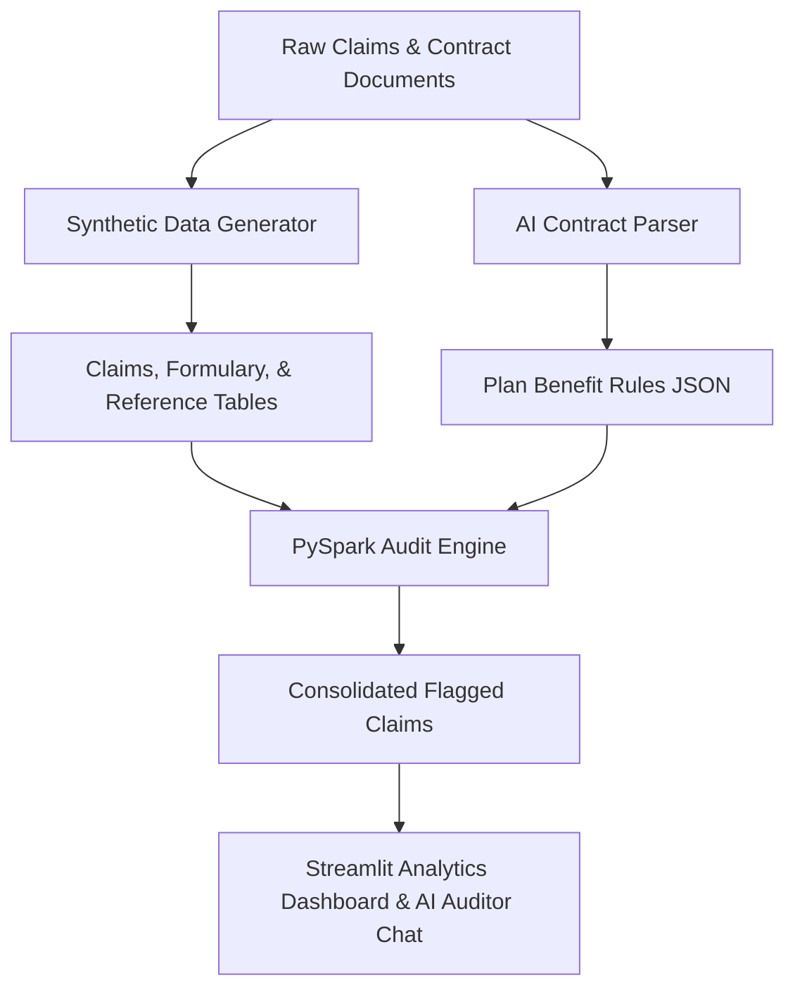

# PBM Claims Audit & AI Platform with Databricks

[](https://www.python.org/)
[](https://spark.apache.org/)
[](https://streamlit.io/)

An enterprise-grade Pharmacy Benefit Manager (PBM) Claims Audit platform built on **PySpark** (for large-scale data engineering) and **Generative AI** (for automated contract parsing and natural language auditing). 

This project implements 100% electronic pharmacy claims audits based on **Next Generation PBM Best Practices Series: Pharmacy benefit claims auditing** guidelines, showcasing a complete workflow from raw claims ingestion to visual executive insights.

---

## 🏗️ Architecture Overview



The system comprises four core components:
1. **Synthetic Data Generator**: Simulates realistic pharmacy claims databases, member eligibility files, and NDC reference drug pricing master lists, complete with embedded compliance errors.
2. **AI Contract Parser**: Uses LLM-driven structured outputs to extract benefit designs, copay schedules, refill thresholds, and rebate guarantees from unstructured plan documents (SPDs).
3. **PySpark Audit Engine**: A Databricks-ready engine executing 100% electronic claims audits using PySpark SQL and window functions for enterprise scale.
4. **Streamlit Executive Dashboard**: A premium, visually stunning portal containing financial KPI summary tiles, drilldown data tables, and an interactive **AI Auditor chatbot** helping plan sponsors query findings in plain English.

---

## 🕵️ Implemented Next Generation Audit Tests

This solution implements the core electronic audit tests described by Next Generation standards to monitor payment integrity and recover overpayments:

1. **Invalid NDC Claims**: Flags claim lines billed with National Drug Codes (NDCs) that do not exist in the master reference drug database.
2. **Questionable AWP Claims**: Flags claims where the billed Average Wholesale Price (AWP) is higher than the reference database AWP (recalculated: quantity × unit AWP) by more than 1%.
3. **Dispensed as Written (DAW) Penalty**: Flags brand-name claims filled under DAW 1 or 2 where a generic equivalent was available, but the PBM bypassed charging the member the required cost-difference penalty.
4. **Incorrect Copay**: Flags claims where the member's paid copay did not match the plan benefit design copay schedule (e.g. Retail vs Mail Order, Generic vs Brand).
5. **Duplicate Claims**: Identifies identical claims (same member, same drug, same day) where multiple payments were processed.
6. **Refill-Too-Soon**: Flags claims filled before the member consumed the plan's threshold (e.g., 75% or 80%) of their previous fill's days supply.
7. **PBM Rebate Guarantees Reconciliation**: Computes minimum manufacturer rebate yields by drug tier and channel (Retail Brand/Generic, Mail Brand/Generic, Specialty Brand/Generic) and reconciles performance against contractual guarantees.

---

## 🚀 Getting Started (Local Run)

### 1. Prerequisites
- Python 3.9 or higher
- Java Runtime Environment (JRE) 8 or 11 (required for PySpark local mode)

### 2. Installation
Clone the repository and set up a Python virtual environment:
```bash
# Navigate to project directory
cd pbm-audit-databricks

# Create virtual environment
python3 -m venv .venv
source .venv/bin/activate

# Install dependencies
pip install -r requirements.txt
```

### 3. Configure AI (Optional)
To activate conversational LLM capabilities, create a `.env` file in the root directory:
```env
OPENAI_API_KEY=your-actual-api-key-here
```
*Note: If no API key is provided, the platform will automatically fall back to rule-based regex parsing and static AI templates so that all features remain completely functional.*

### 4. Run the Orchestrator
Execute the complete backend run to generate synthetic claims, extract contract rules, and execute the PySpark audit engine:
```bash
PYTHONPATH=. python scripts/run_all.py
```

### 5. Launch the Dashboard
Start the visual Streamlit application to explore findings and chat with the AI Auditor:
```bash
streamlit run app/main.py
```

---

## ☁️ Databricks Deployment Guide

The code is structured to easily import and execute inside a **Databricks Workspace**:

1. **Import Notebooks**:
   - In your Databricks Workspace, select **Import** on your target directory.
   - Upload the notebooks located under the `notebooks/` folder:
     - `notebooks/01_data_generator.py`
     - `notebooks/02_ai_contract_parser.py`
     - `notebooks/03_pbm_audit_engine.py`
2. **Library Installation**:
   - Install the package dependencies by attaching a cluster library or including a `%pip install -r requirements.txt` cell at the top of your notebooks.
3. **Delta Lake Optimization**:
   - The engine code is ready to save outputs in Delta Lake format (`.write.format("delta").mode("overwrite").save(...)`) on DBFS or Unity Catalog.

---

## 🧪 Running Tests

Verify the business logic and PySpark transformations locally:
```bash
pytest tests/
```

---

## 📄 License
This project is licensed under the MIT License - see the LICENSE file for details.
